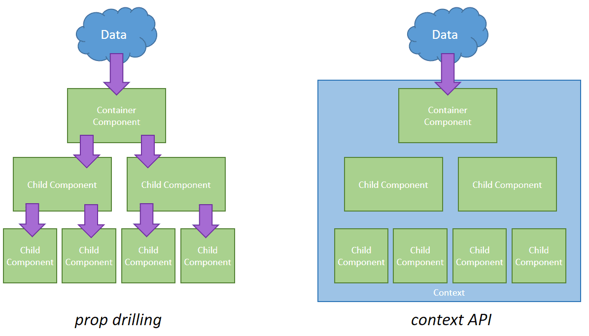

## First TypeScript+React experiance

The main goal of this project was to practice in the Typescript language in conjunction with the React library.
Also, on the example of this project, I wanted to face and show the problem of prop drilling. In the future, it is
planned to make a second version, which will use a different approach, namely the Context API or work with the Redux
state manager

## Available Scripts

In the project directory, you can run:

### `npm start`

Runs the app in the development mode.\
Open [http://localhost:3000](http://localhost:3000) to view it in the browser.

The page will reload if you make edits.

